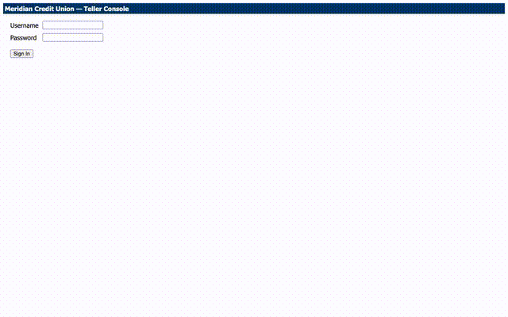

# Computer-Use Automation System

A small, real implementation of the interface.ai take-home: an LLM ("computer use") discovers
how to complete a task in a legacy, no-API back-office application; the successful run is
recorded as a typed, versioned **capability artifact**; the artifact then **replays
deterministically**, with no model in the loop, distinguishing business outcomes from
recoverable conditions from hard failures; and a real human-escalation/handoff mechanism lets
an operator take over the *same live session* and hand control back.

```
 goal ──▶ discover (LLM + live app) ──▶ capability artifact ──▶ replay (no LLM)
                                                                     │
                                                          stuck / risky action?
                                                                     ▼
                                                     escalate ──▶ human acts on the
                                                                  same live session ──▶ resume
```

See `/REPORT.md` for the design write-up (architecture, artifact schema, determinism/error
handling, heterogeneity & multi-tenant story, escalation model, safety model, cuts).

## Setup

Requires Node 20+ and an Anthropic API key (only needed for `discover`; `replay` never calls an
LLM).

```bash
npm install
npx playwright install chromium
cp .env.example .env   # then fill in ANTHROPIC_API_KEY
```

`.env` variables:

| Variable | Default | Purpose |
|---|---|---|
| `ANTHROPIC_API_KEY` | — | required for `discover` only |
| `TARGET_APP_PORT` | 4100 | the mock target app |
| `OPERATOR_PORT` | 4200 | the operator HTTP API (started automatically by `discover`/`replay`) |
| `TARGET_APP_USERNAME` / `TARGET_APP_PASSWORD` | `teller` / `teller123` | mock app login, injected at replay time, never accepted as an agent-supplied parameter |

## Quick demo (3 commands)

```bash
npm run target-app                                                              # terminal 1

npm run discover -- --member 10023 --type share --nickname "Holiday Fund" \
  --deposit 50 --auto-approve-risky true                                        # terminal 2

npm run replay -- --member 40040 --type money_market --nickname "Retirement Boost" --deposit 200
```

That's the full vertical slice: a **real, live Claude-driven run** against the app started in
terminal 1 (logs in, looks up member `10023`, reads the savings balance, opens a sub-account,
extracts the confirmation number, saves `artifacts/open_sub_account.v1.json`), then a
**deterministic replay** of the exact same capability with no LLM involved, against a different
member. Member `40040` also exercises the *recoverable* condition path for free: the mock app
forces a one-time "session expired" interstitial, which replay detects and clears automatically
before continuing (see `run.jsonl`'s `replay_recoverable_condition` event).

`--auto-approve-risky` does two things: it skips the interactive risk-confirmation gate on the
(correctly risk-classified) "Open Sub-Account" click during discovery, and marks the resulting
artifact `approved` so the replay above doesn't need a separate sign-off step.

**One more command: a business outcome, not a crash:**

```bash
npm run replay -- --member 99999 --type share --nickname "Test" --deposit 25
# -> {"status":"business_outcome","outcome":"member_not_found", ...}
```

**One more: the escalation/handoff mechanism, for real.** `replay` gates any risky-classified
step (here, "Open Sub-Account") behind human authorization unless the artifact it's replaying is
`approval: "approved"`. The quick demo above auto-approved its artifact, so this uses a second
copy of it left in `draft` for exactly this purpose (`artifacts/open_sub_account.v1-draft.json`):

```bash
npm run replay -- --artifact artifacts/open_sub_account.v1-draft.json \
  --member 10023 --type christmas_club --nickname "Escalation Demo" --deposit 60 &

curl -s http://localhost:4200/interventions                  # pending intervention + reason
curl -s http://localhost:4200/interventions/intervention-1    # live snapshot + screenshot path (find the button's refId)

# the operator performs the click on the live session directly, instead of just authorizing it
curl -s -X POST http://localhost:4200/interventions/intervention-1/actions \
  -H "Content-Type: application/json" -d '{"type":"click","refId":"f0_3"}'
curl -s -X POST http://localhost:4200/interventions/intervention-1/resume \
  -H "Content-Type: application/json" -d '{"resolution":"approved"}'
```

The backgrounded replay resumes and completes -- and does **not** click "Open Sub-Account" a
second time, because it recognizes the operator already performed that step (see `run.jsonl`'s
`replay_step_completed_by_human` event). `evidence/INDEX.md` points at the exact captured run.

## Screen recording



`evidence/videos/` has real screen recordings (Playwright's own video capture, not staged) of the
three scenarios above, from a separate run of the same commands:
[`discovery.mp4`](evidence/videos/discovery.mp4) (the live LLM run),
[`replay-happy.mp4`](evidence/videos/replay-happy.mp4) (deterministic replay), and
[`escalation.mp4`](evidence/videos/escalation.mp4) (pause -> operator acts -> resume, the clip the
GIF above is from).

## What's here

- **Target application** (`src/target-app`): a mock "Meridian Credit Union" teller console --
  server-rendered HTML, table-based layout, no test IDs, one `<iframe>` (deliberately, to force
  frame-aware perception/locating). This stands in for the real thing per the assignment's
  ground rules (no real bank system, no real credentials/PII).
- **Discovery agent** (`src/agent`): an observe -> decide -> act loop driven by Claude
  (`claude-sonnet-4-5`), perceiving the page via a runtime-derived accessibility-style snapshot
  (role, accessible name, visible text) rather than a fixed DOM -- built to survive a surface
  with no clean DOM or test IDs.
- **Capability artifact** (`src/artifact`): a versioned, zod-validated schema for the recorded
  flow -- steps, locator fallback chains with robustness reasoning, typed inputs/outputs, a
  success checkpoint, and a declared outcome taxonomy.
- **Replay executor** (`src/replay`): deterministic, no-LLM execution of a saved artifact, with
  a real error taxonomy (business outcome / recoverable / hard failure) and stable locator
  resolution with fallbacks. The actual click/type/select/extract dispatch (`replay/locator.ts`'s
  `performLocatorAction`) is shared with the discovery agent loop -- one implementation, not two
  that can drift apart.
- **Guardrails** (`src/guardrails`): an origin *and* route allowlist, risk classification
  (computed once at record time, not re-derived from text at replay time), and redaction of
  sensitive data from every log and artifact.
- **Escalation & handoff** (`src/escalation`): a session manager that lets automation pause,
  cede control of the *live* Playwright session, and resume, plus a minimal (but real) HTTP
  operator API and console.
- **Evidence** (`/evidence`): real logs + screenshots from the discovery run and three replay
  runs (happy path + recoverable condition, business outcome, escalation). See
  `evidence/INDEX.md`.

## Tests

```bash
npm test        # node's built-in test runner, no extra framework
npm run typecheck
```

Tests cover the locator fallback ordering/robustness logic, the route-allowlist and URL-pattern
matcher used by outcome/checkpoint detection, and the redaction utilities -- the parts where a
silent regression would be hardest to notice by just eyeballing a passing demo run.
